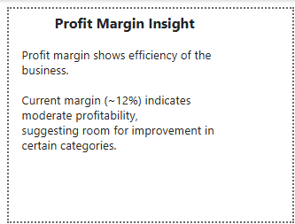

#  Superstore Sales Dashboard (Power BI)

##  Project Overview

This project presents an interactive Power BI dashboard analyzing sales performance, customer behavior, and profitability using the Superstore dataset.

The goal is to derive meaningful business insights and present them through a clean and interactive dashboard.

---

##  Key Features

* KPI tracking (Sales, Profit, Orders, Profit Margin)
* Monthly sales trend analysis
* Category-wise sales and profit comparison
* Top 10 customers by revenue
* Region and category-based filtering
* Custom tooltip for profit margin insights

---

##  Dashboard Preview

###  Main Dashboard


###  Tooltip Insight



---

##  Key Insights

* Technology generates the highest revenue and profit.
* Furniture shows low profitability despite decent sales.
* Profit margin (~12%) indicates moderate business efficiency.
* A small group of customers contributes significantly to total revenue.
* Sales show variation over time with noticeable growth trends.

---

##  Tools & Technologies Used

* Power BI
* Power Query (Data Cleaning)
* DAX (Profit Margin Calculation)
* Data Visualization

---

##  Project Structure

```
 superstore-sales-dashboard-powerbi
 ┣  images
 ┃ ┣ dashboard_overview.png
 ┃ ┗ tooltip_view.png
 ┣  Superstore_Dashboard.pbix
 ┗  README.md
```

---

##  How to Use

1. Download the `.pbix` file
2. Open in Power BI Desktop
3. Interact with filters and visuals

---

##  Author

Shashwat Krishna
Aspiring Data Analyst

---

##  Future Improvements

* Add more advanced DAX measures
* Include forecasting
* Enhance UI design with themes
